# SQL IMPORTING AND CLEANING DATA

In  episode of my SQL Learning journey , I learnt how to import external date and query it, i also learnt how to clean data and extract insights needed for solving problems from it.

_DISCLAIMER - The data used in this report does not in any way represent any instituition or company, just a dummy dataset created by me for this purpose_.

## TASKS TO BE CARRIED OUT

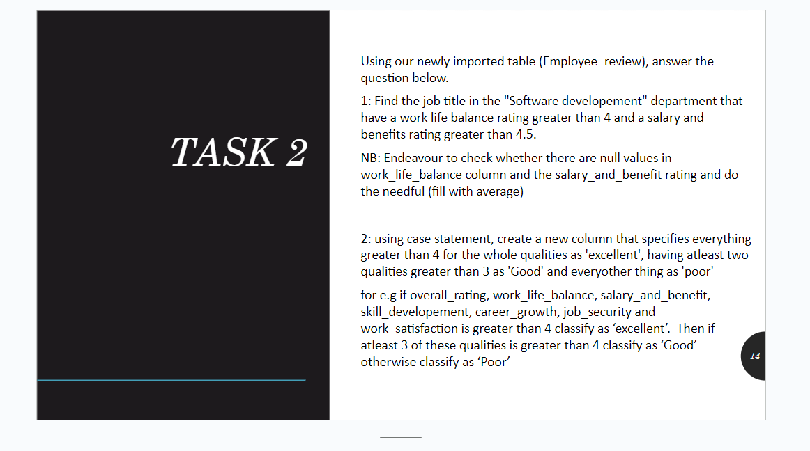

### ACTIONS CARRIED OUT

1. CREATION OF DATABASE
2. IMPORTING OF DATASET
3. DATA CLEANING
4. 

## ANLYSIS

### DATABASE CREATION

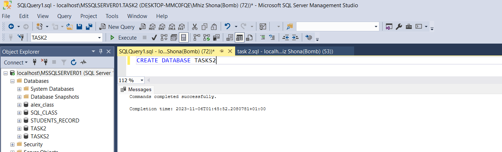

I CREATED A DATABASE CALLED **TASKS2** 

### TABLE IMPORTATIOM

 STEP 1               |      STEP 2           |   Table imported
:--------------------:|:---------------------:|:--------------------:|   
 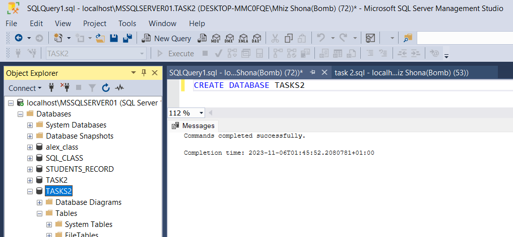           |        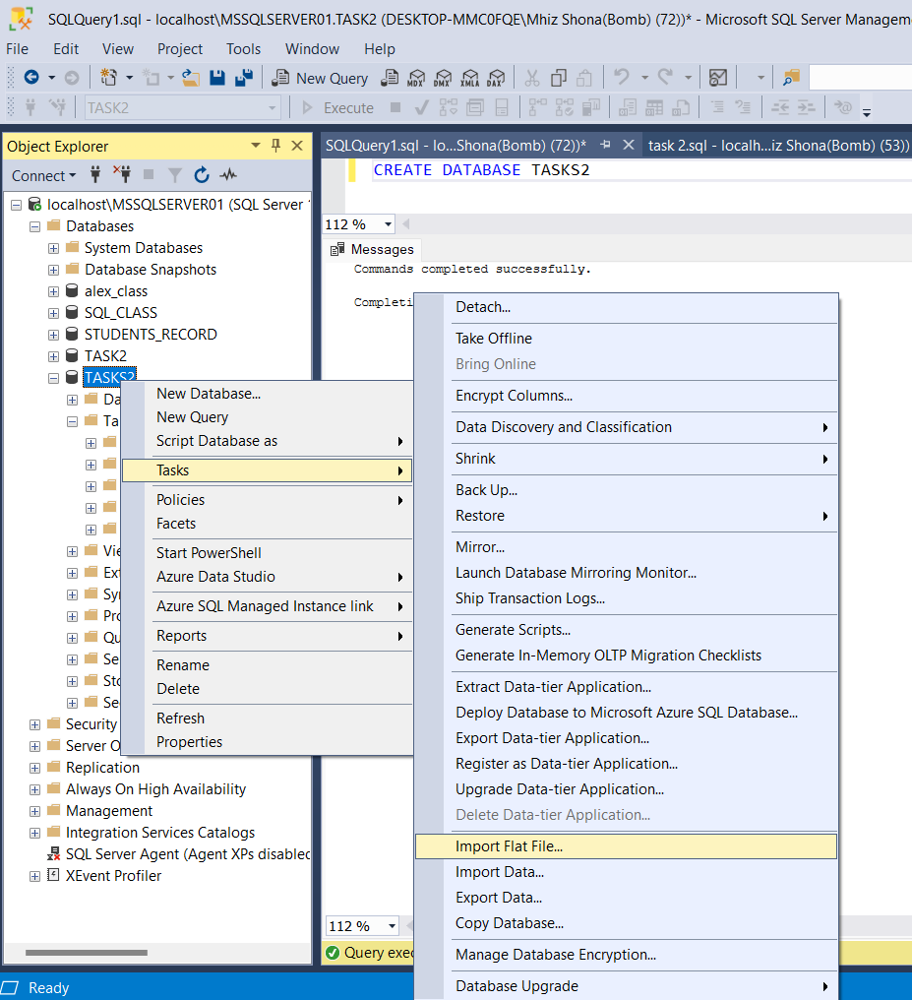     |         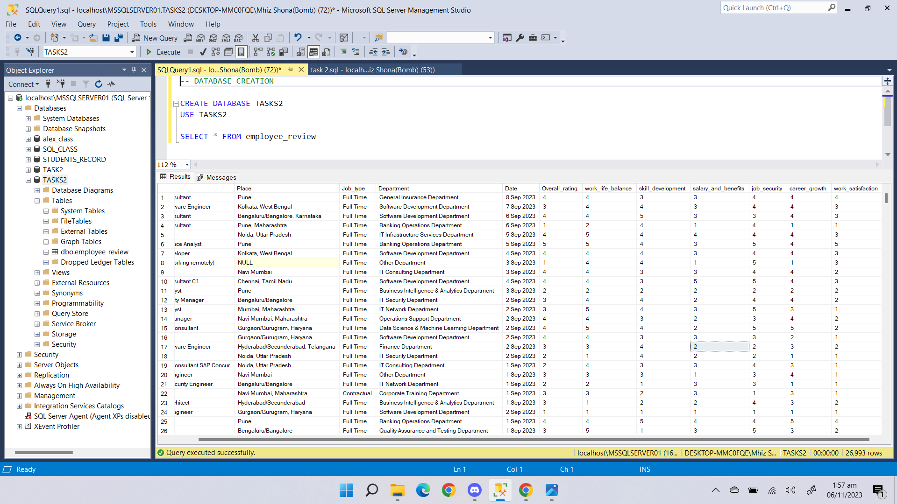

   
- I IMPORTED THE TABLE NAMED **'Employee_review'** to the database using my the flat file import option

### INSPECTION AND CLEANING

- I INSPECTED THE DATA AND NOTICED THAT IT HAD A ALOT OF NULL VALUES IN DIFFERENT COLUMNS WHICH WOULD AFFECT THE RESULTS OF OUR QUERIES SO I WENT AHEAD TO FIX THAT.

  
 ### CLEANING.
 
**COLUMN 1**

   - TO REPLACE THE **NULL** VALUES , I HAD TO FIND THEM FIRST USING SELECT * FROM employee_review
WHERE work_life_balance IS NULL

    
    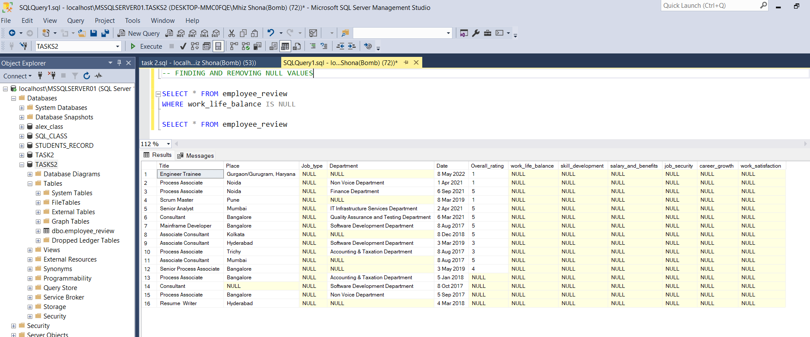
    

   - TO REPLACE THE NULL VALUES IN THE WORK_LIFE_BALANCE COLUMN WITH NEW VALUES, I CALCULATED THE AVG OF THE COLUMN USING = 
SELECT ROUND(AVG(WORK_LIFE_BALANCE), 0)
FROM employee_review;

 

- I UPDATED THE TABLE WITH THE NEW VALUES
- I UPDATED THE  WORK_LIFE_BALANCE COLUMN TABLE WITH THE AVERAGE OF THE WORK_LIFE_BALANCE

  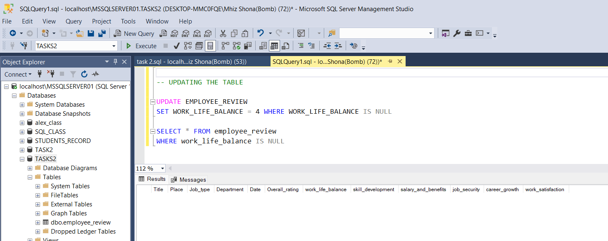

  
** COLUMN 2**

 - TO REPLACE THE **NULL** VALUES , I HAD TO FIND THEM FIRST USING
  SELECT * FROM employee_review
WHERE **salary_and_benefits** IS NULL
    
    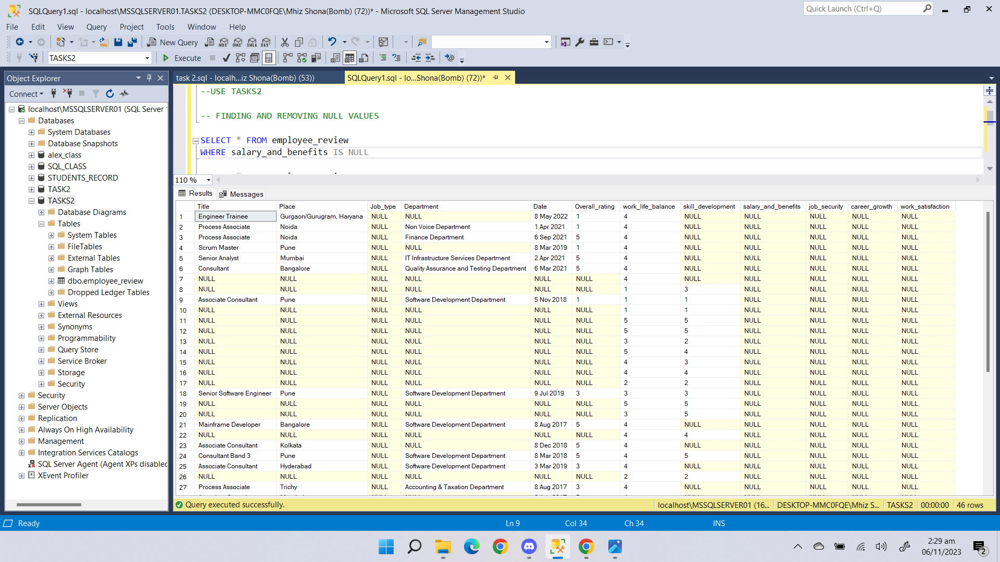
   

   - TO REPLACE THE NULL VALUES IN THE **salary_and_benefits** COLUMN WITH NEW VALUES, I CALCULATED THE AVG OF THE COLUMN USING = 
SELECT ROUND(AVG(salary_and_benefits), 0)
FROM employee_review;

    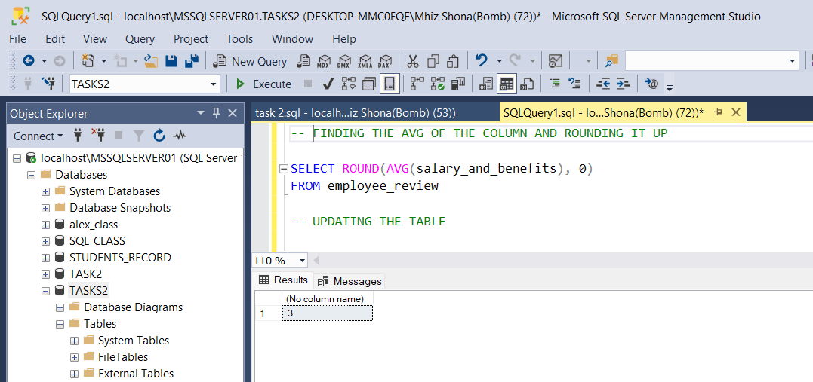

- I UPDATED THE TABLE WITH THE NEW VALUES
- I UPDATED THE  WORK_LIFE_BALANCE COLUMN TABLE WITH THE AVERAGE OF **salary_and_benefits**

 
    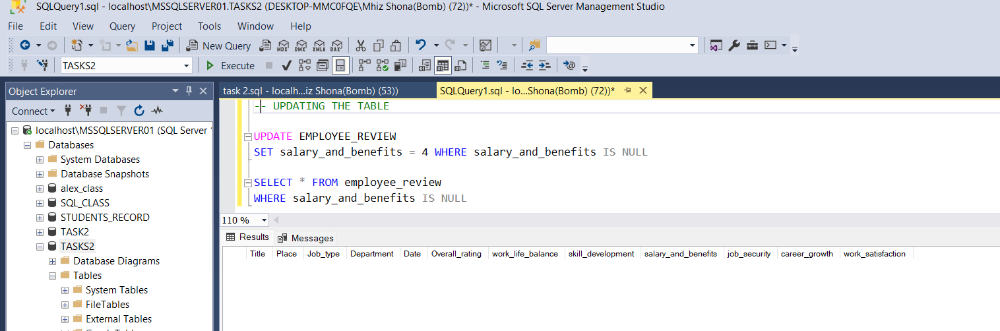

**Finding the job title in the "Software developement" department that have a work life balance rating greater 
than 4 and a salary and benefits rating greater than 4.5**

- TO ANSWER THIS , I USED
  
SELECT Title
FROM Employee_REVIEW
WHERE Department = 'Software Development Department'
    AND Work_Life_Balance > 4
    AND Salary_and_benefits > 4.5;.

    

**Using case statement, create a new column that specifies everything greater than 4 for the whole qualities 
  as 'excellent', having atleast two qualities greater than 3 as 'Good' and everyother thing as 'poor'**
 

 TO ANSWER THIS , I HAD TO
 - TO WRITE THE CASE STATEMENT AND EXECUTED IT TO BE SURE NOTHING IS WRONG WITH OUR CODE THEN
  
 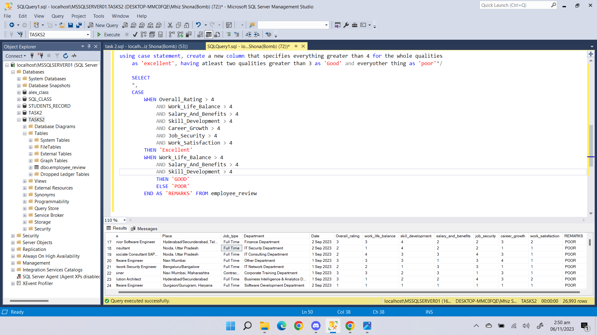
 

 - I ALTERED THE TABLE BY CREATING A NEW COLUMN NAMED **REMARKS** WITH VARCHAR(50)

  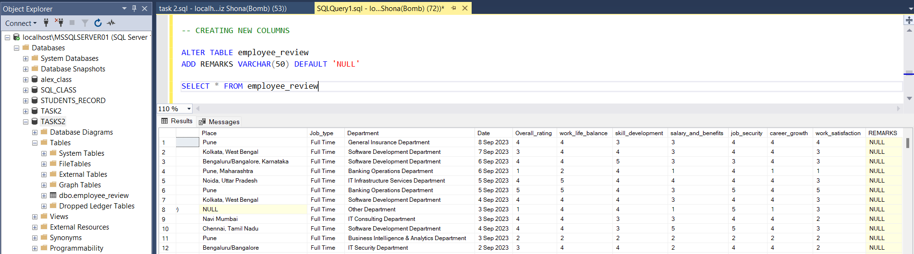

  
 - AFTER WHICH I WENT AHEAD TO UPDATE THE NEWLY CREATED COLUMNS

 - 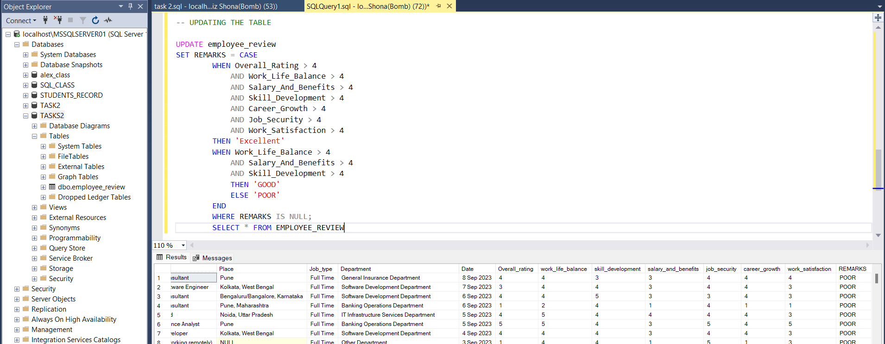

 ## THOUGHTS

 SQL is english, at least thats what i think, using syntax for everything make it hard to keep up with buh whats life without challenges right?
 learning is nice, each day am reminded that no one would do it for me so i dust my ass and get to work.
 LOOKING FORWARD TO THE NET THING TO LEARN. 💂‍♂️.
  
    
    

